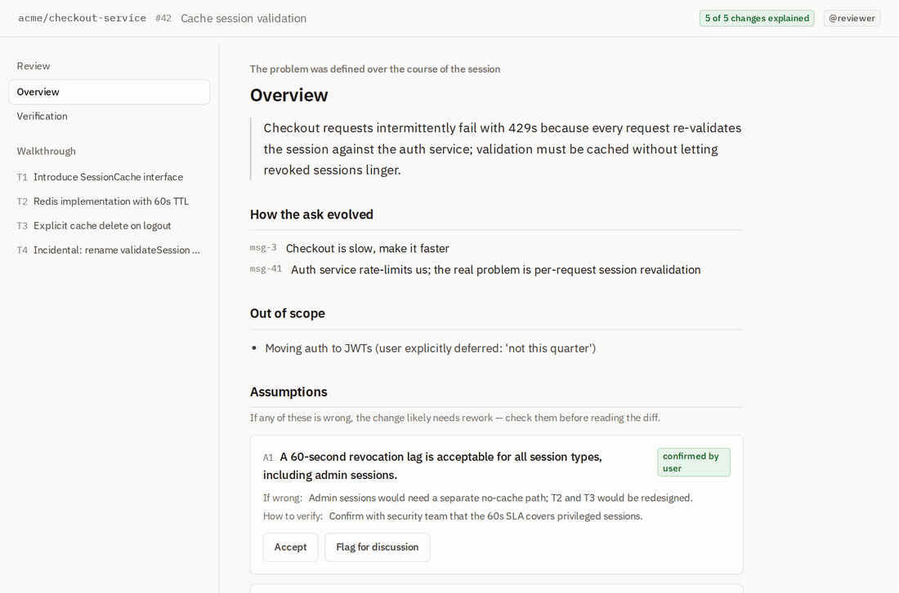

<h1 align="center">Review Assist</h1>

<p align="center">
  <strong>Review AI-written code as fast as agents write it.</strong><br>
  Turn a coding agent's session into a guided, verifiable pull-request review.
</p>

<p align="center">
  <a href="#the-problem">Problem</a> ·
  <a href="#how-it-works">How it works</a> ·
  <a href="#the-intent-document">Format</a> ·
  <a href="#quickstart">Quickstart</a> ·
  <a href="#deployment">Deployment</a>
</p>

<p align="center">
  
</p>

---

## The problem

Most code today is written by AI agents — Claude, Cursor, Codex, Copilot. The review
process wasn't built for that. A human reviewer can't read diffs as fast as a fleet of
agents produces them, and the tools meant to help only look at the *finished diff* — so
they can, at best, **guess** why a change was made.

The information that makes review fast lives in the *session*: what the user actually
asked for, which alternatives the agent tried and abandoned, what it assumed, what it
tested. That context is thrown away the moment the PR opens.

**Review Assist captures it at the source and turns it into the review.** An agent's
session becomes an **Intent Document** — a structured, redacted artifact that explains the
change the way its author would: problem first, assumptions up front, a guided walkthrough
where every stop is anchored to real diff hunks, and an honest account of what was and
wasn't verified. A validator then proves the document actually covers the diff, and a
GitHub app renders it as a guided review on top of the pull request.

It's fully open source, self-hostable, and **stores none of your code** — the validator
runs in your CI, the viewer renders in the reviewer's browser.

## How it works

```
 coding agent session  ──►  distillation  ──►  Intent Document  ──►  validator ──► guided review
 (Claude Code, Cursor)      author ⇄ reviewer   .intent/<branch>.json    (CI)         (GitHub app)
                            agents, fresh ctx
```

1. **Capture & distill.** After a session, a two-agent pass — an *author* hydrated from the
   full transcript and an independent *reviewer* that interrogates it — produces the Intent
   Document. Runs in a fresh context, so it costs the working session nothing and sees even
   what compaction dropped. Exposed as an **MCP server** so any MCP-capable agent can drive it.
2. **Validate.** A deterministic **CLI**, plus a **GitHub App** that checks every PR against
   the diff: schema, staleness, coverage (every change explained), cross-references, and secret
   redaction — then posts a guided-review check and summary comment automatically. Zero config.
3. **Review.** The **GitHub App** renders the guided walkthrough — assumptions to check first,
   then an anchored tour of the change, with a coverage overlay flagging anything unexplained.

## The Intent Document

One open format ([`packages/schema`](packages/schema)), six sections, each earning its
place in a review. See [`packages/schema/src/example.json`](packages/schema/src/example.json).

| Section | Why a reviewer cares |
|---|---|
| **problem** | The concrete ask (post-hoc), how it evolved, verbatim user quotes, what's out of scope. |
| **assumptions** | The front page: what the change assumes, blast radius if wrong, how to verify — reject bad framing in 2 minutes. |
| **approach** | Requirements, and **rejected alternatives** — the thing diff-only tools can never know. |
| **tour** | A narrative walkthrough; every stop anchored to real diff hunks, so coverage is checkable. |
| **verification** | What was actually run — and an honest `not_verified` list. |
| **meta** | Session, commit range (staleness), pipeline provenance. |

## What's in this repo

| Path | Component |
|---|---|
| [`packages/schema`](packages/schema) | The format — JSON Schema (draft 2020-12) + TypeScript types |
| [`packages/validator`](packages/validator) | `review-assist` CLI + library: the five checks and the Markdown renderer |
| [`packages/mcp-server`](packages/mcp-server) | MCP server that drives distillation and gatekeeps submissions |
| [`apps/github-app/worker`](apps/github-app/worker) | Stateless Cloudflare Worker: OAuth broker + thin GitHub proxy |
| [`apps/github-app/viewer`](apps/github-app/viewer) | Client-side guided-review viewer (Tailwind theme, self-hosted fonts) |

## Quickstart

```bash
npm install
npm run build

# Validate the example Intent Document
node packages/validator/dist/cli.js validate packages/schema/src/example.json

# Render the Markdown summary (posted on the PR and shown in the viewer)
node packages/validator/dist/cli.js render packages/schema/src/example.json

# Preview the guided viewer with mock data → http://localhost:8787/#acme/checkout-service/pull/42
node scripts/mockserver.mjs
```

Run the tests: `npx vitest run`.


## Deployment

- **GitHub App** — one-time install; reviewers sign in once. A webhook validates every PR
  (guided-review check + summary comment) with zero config — no workflow file, no runner
  minutes. The viewer renders client-side; the Cloudflare Worker signs the app JWT, brokers
  OAuth (GitHub's token endpoint lacks CORS), and proxies the document + diff with an
  installation/reviewer token. **Stateless** — no KV/D1/R2/DO; private-repo responses are
  `private, no-store` and never edge-cached; static assets are.

See [`SPEC.md`](SPEC.md) for the frozen design and [`apps/github-app/viewer/DESIGN.md`](apps/github-app/viewer/DESIGN.md)
for the UI design rules.

## License

[Apache-2.0](LICENSE).
