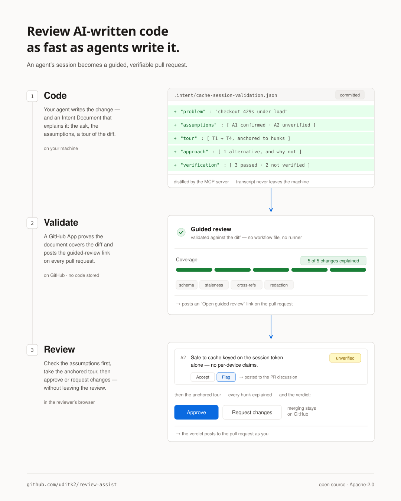

<h1 align="center">Review Assist</h1>

<p align="center">
  <strong>Review AI-written code as fast as agents write it.</strong><br>
  Turn a coding agent's session into a guided, verifiable pull-request review.
</p>

<p align="center">
  <a href="#install">Install</a> ·
  <a href="#how-it-works">How it works</a> ·
  <a href="#the-intent-document">Format</a> ·
  <a href="#developing">Developing</a>
</p>

<p align="center">
  
</p>

---

AI agents write code faster than anyone can read diffs — and the context that makes
review fast (what was asked, what was assumed, what was tried and abandoned, what was
tested) is thrown away the moment the PR opens. Review Assist captures it at the source:
an agent's session becomes an **Intent Document**, a validator proves it actually covers
the diff, and a GitHub App renders it as a guided review on top of the pull request.

Fully open source, self-hostable, and **stores none of your code** — validation runs
against the diff on GitHub's side of the fence, and the viewer renders live in the
reviewer's browser.

## Install

Two one-time installs — the MCP server on the developer's side, the GitHub App on the repo's.

**1. Register the MCP server with your agent** (so it can author Intent Documents).

Claude Code:

```bash
claude mcp add -s user review-assist -- npx -y review-assist-mcp
```

Codex — add to `~/.codex/config.toml`:

```toml
[mcp_servers.review-assist]
command = "npx"
args = ["-y", "review-assist-mcp"]
```

Claude desktop app — one-click, no terminal:
[download the `.mcpb`](https://github.com/uditk2/review-assist/releases/latest/download/review-assist-mcp.mcpb)
and open it.

**2. [Install the GitHub App →](https://github.com/apps/review-assist-guided-review)**

One click. Read-only code + PR comments, no workflow files — it adds the automatic
check on every PR, the summary comment, and the guided-review viewer.

## How it works

<p align="center">
  
</p>

1. **Capture.** After a session, a two-agent pass — an *author* hydrated from the full
   transcript and an independent *reviewer* that interrogates it — distills the Intent
   Document. Runs in a fresh context via the MCP server, so it costs the working session
   nothing and sees even what compaction dropped.
2. **Validate.** The GitHub App checks every PR against the diff — schema, staleness,
   coverage (every change explained), cross-references, secret redaction — and posts a
   check plus a guided-review link. Zero config. The same checks run standalone via the
   `review-assist` CLI.
3. **Review.** The viewer renders the walkthrough — assumptions to check first, then an
   anchored tour of the change, with a coverage overlay flagging anything unexplained.
   Comments and the verdict sync back to GitHub.

Full diagram and internals: [`docs/ARCHITECTURE.md`](docs/ARCHITECTURE.md).

## The Intent Document

One open format ([`packages/schema`](packages/schema)), six sections: the **problem**
as actually asked, **assumptions** with blast radius, the **approach** including
rejected alternatives, a **tour** anchored to real diff hunks, honest **verification**
(including what *wasn't* verified), and **meta** for staleness and provenance. See the
[example](packages/schema/src/example.json), and [`SPEC.md`](SPEC.md) for the frozen
design.

## Developing

| Path | Component |
|---|---|
| [`packages/schema`](packages/schema) | The format — JSON Schema (draft 2020-12) + TypeScript types |
| [`packages/validator`](packages/validator) | `review-assist` CLI + library: the five checks and the Markdown renderer |
| [`packages/mcp-server`](packages/mcp-server) | MCP server that drives distillation and gatekeeps submissions |
| [`apps/github-app/worker`](apps/github-app/worker) | Stateless Cloudflare Worker: OAuth broker + thin GitHub proxy |
| [`apps/github-app/viewer`](apps/github-app/viewer) | Client-side guided-review viewer |

```bash
npm install
npm run build

# Validate and render the example Intent Document
node packages/validator/dist/cli.js validate packages/schema/src/example.json
node packages/validator/dist/cli.js render packages/schema/src/example.json

# Preview the guided viewer with mock data → http://localhost:8787/#acme/checkout-service/pull/42
node scripts/mockserver.mjs

# Tests
npx vitest run
```

Architecture and internals: [`docs/ARCHITECTURE.md`](docs/ARCHITECTURE.md).

## License

[Apache-2.0](LICENSE).
