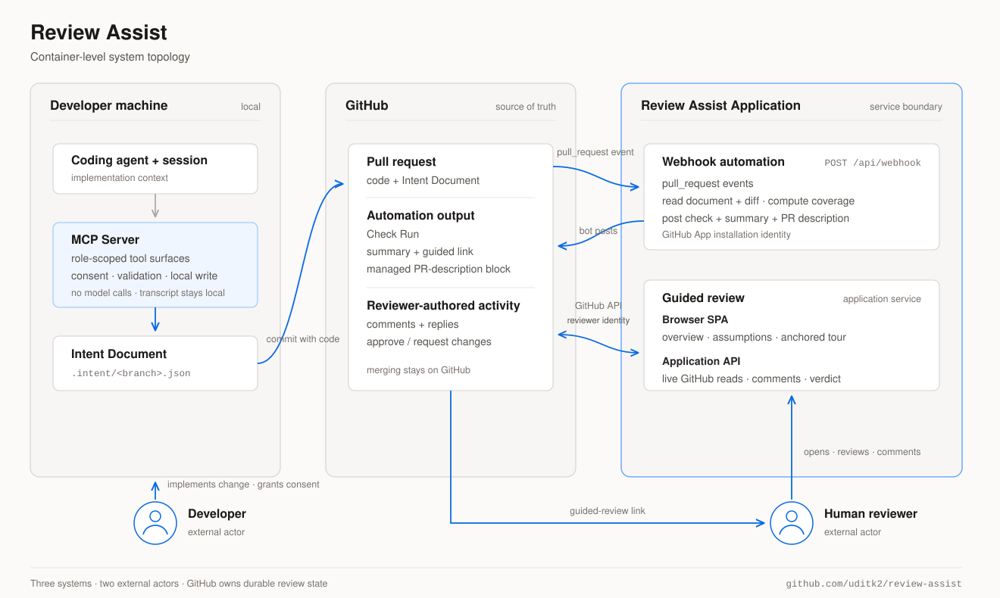

# Architecture

Three sides — **author**, **repository**, **reviewer**. A coding session becomes an Intent
Document; the document is surfaced on the PR automatically; a human reviews it with
comments that live on GitHub. Each layer runs in a different place, and each place makes
a privacy claim the design has to keep.

  .json; on GitHub the App validates it against the diff and posts a check with a guided-review link; in the reviewer's browser the guided viewer renders the walkthrough and comments and the verdict land back on the pull request." width="680">

**1. Distillation (developer's machine).** A stdio MCP server runs a two-role pass over
the session: an *author* hydrated from the full transcript, an independent *reviewer*
that interrogates it against the diff. Rounds are recorded, so `meta.interview` is
server-attested. Transcript discovery covers Claude Code and Codex, ranked by relevance
to the change. Transcripts never leave the machine — only the distilled document does.

**2. Validation (GitHub + CI).** `submit_document` runs the five deterministic checks —
schema, coverage (every substantive hunk explained), staleness, cross-references, secret
redaction — and writes `.intent/<branch>.json`, committed with the code. The same checks
run standalone via the `review-assist` CLI.

**3. Webhook (Cloudflare Worker).** The GitHub App verifies the webhook signature, mints
an installation token (App JWT), re-validates doc against diff, and posts a Check Run
plus a summary comment with the guided-review link. Install once; no workflow files, no
runner minutes, comment-only permissions.

**4. Viewer (reviewer's browser).** The same stateless Worker brokers GitHub-App
user-to-server sign-in and proxies reads with the reviewer's own token; the SPA renders
the front page, anchored tour, coverage overlay, and verification client-side. No
KV/D1/R2/DO — the only state is an encrypted session cookie, and repo content is served
`private, no-store`.

**5. Comments and verdict (GitHub).** GitHub is the source of truth: inline *review
comments* on diff lines, *issue comments* for framing items, and the review verdict
(approve / request changes) submitted as the signed-in reviewer. Merging stays on GitHub.
