# Architecture

Three sides — **author**, **repository**, **reviewer**. A coding session becomes an Intent
Document; the document is surfaced on the PR automatically; a human reviews it with comments
that live on GitHub.

```mermaid
flowchart LR
  subgraph AUTHOR["Author"]
    A1["Coding session<br/>Claude Code / Codex"]
    A2["MCP server<br/>author &#8644; reviewer interview"]
    A3["Intent Document<br/>.intent/{branch}.json"]
    A1 -- transcript --> A2
    A2 -- distill --> A3
    A2 -. "interview &#215;N" .-> A2
  end
  subgraph REPO["Repository · GitHub"]
    R1(["Pull request"])
    R2["GitHub App<br/>webhook + validator"]
    R3["Check + comment<br/>guided-review link"]
    A3 -- committed with code --> R1
    R1 -- pull_request --> R2
    R2 --> R3
  end
  subgraph REVIEWER["Reviewer"]
    V1["Guided viewer<br/>walkthrough"]
    V2["Inline + global comments"]
    R3 -- open review --> V1
    V1 --> V2
    V2 -- review / issue comment --> R1
  end
```

**1. Author — MCP server.** A stdio server runs a two-role distillation: an *author* hydrates from the session transcript, a *reviewer* interrogates it from the diff. Rounds are recorded, so `meta.interview` is server-attested. Discovery covers Claude Code + Codex, ranked by relevance.

**2. Generation.** `submit_document` validates (schema, coverage, staleness, cross-refs, redaction) and writes `.intent/<branch>.json`, committed with the code.

**3. Webhook.** The GitHub App verifies the signature, mints an installation token (App JWT, PKCS#1 to PKCS#8), reads doc + diff, posts a Check Run + summary comment. Install-once, no workflow files, comment-only.

**4. Viewer.** A stateless Cloudflare Worker brokers GitHub-App user-to-server sign-in and proxies reads with the reviewer's token. The SPA renders the front page, anchored tour, coverage, and verification.

**5. Comments.** GitHub is the source of truth: inline *review comments* on diff lines, global *issue comments* for framing items. Writing needs PR write.
